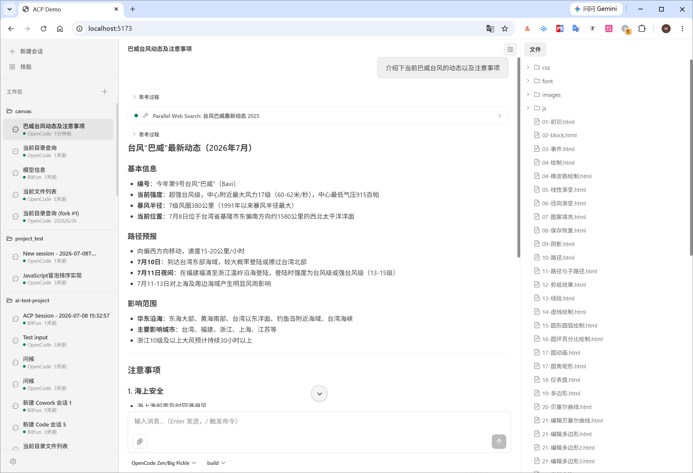
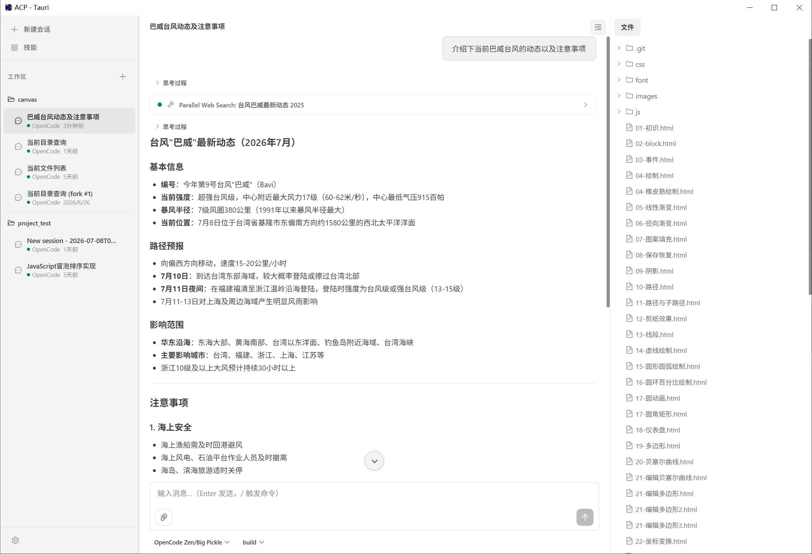

# acp-components

A universal frontend component library for building AI Agent interfaces based on the [Agent Client Protocol (ACP)](https://github.com/agentclientprotocol/agent-client-protocol). Designed with a **data-layer / UI-layer separation** architecture:

- **`@acp-components/core`** — Framework-agnostic TypeScript module: transport communication, state management, business logic
- **`@acp-components/react`** — React component library: UI rendering and user interaction

You can use the data layer alone to build UI component libraries with Vue, Svelte, or any other frontend framework.

## Features

- **Multi-Agent** — Connect to multiple ACP agents simultaneously, each with independent transport, capabilities, and session management. User-added agents are persisted to `storage('agents')` and restored on next launch; built-in (host-supplied) agents are never user-removable
- **Multi-Workspace** — Organize sessions by working directory (cwd); switch between workspaces seamlessly. Workspace list is persisted to `storage('workspaces')` via the built-in `<PlatformWorkspacesAuto>` driver
- **Framework-Agnostic Core** — Zustand vanilla stores with zero React dependency; works with Vue, Svelte, Solid, or vanilla JS
- **Multi-Transport** — Stdio, HTTP, WebSocket, and custom transports per agent. Stdio spawn capability is supplied by the host via `platform.process.createStdioTransport` (a web host that cannot spawn a child process simply omits it); ships with a Tauri IPC example
- **Unified Workbench Shell** — `WorkbenchShell` wires the `Sidebar` (top nav buttons + switchable body + footer) to a main area that swaps views by nav item: Sessions → `SessionView`, Skills → `SkillView`, New Session, Settings, plus host-injected views
- **Rich UI Components** — SessionView (chat + Files side panel with FileTree & FileViewer), SkillView, SettingsView, chat view (with round grouping), diff view, permission dialog, plan view, thought view, command palette, login dialog, dropdown, select, status bar, and more — 25+ components
- **File Tree & File Viewer** — Per-workspace file tree (lazy expand, optional live watch) and an in-panel Monaco-backed file viewer with syntax highlighting and reveal-line; both driven zero-config by `platform.fs`
- **Skills Catalog** — `SkillView` fetches each connected agent's skill catalog live via `listSkills()`, grouped by scope (user-level vs per-project cwd)
- **Settings Surface** — Full-page `SettingsView` with Appearance (theme) and Agents management panels; extensible by appending to `SETTINGS_SECTIONS`
- **Streaming UX** — Real-time content and thought streaming (per-session chunk batching) with animated indicators, live tool call status, and token usage tracking
- **Session Management** — Full CRUD: create, load, switch, close, delete, fork, refresh, and load-more — scoped by workspace and agent
- **Tool Call Visualization** — Track agent tool invocations with status, input/output, file locations, and diffs
- **Authentication** — Built-in auth flow with `LoginDialog` component, env_var and terminal-based auth methods, and programmatic `authenticate`/`authenticateWithEnv` actions
- **Permission Handling** — Promise-based permission flow with built-in modal dialog for approving or rejecting tool call requests
- **Theming** — Dark and light themes via CSS custom properties (`--acp-*` design tokens); runtime switching through `useSettings().setTheme()`; extensible via `data-acp-theme` attribute
- **Internationalization** — Built-in i18n (en-US, zh-CN) via i18next with locale auto-detection sourced from the host `Platform.system.getLocale()`
- **Desktop Ready** — Includes Tauri and stdio transport examples for native desktop applications

## Screenshots

### Web Demo



### Tauri Desktop



## Packages

| Package | Description |
|---------|-------------|
| [@acp-components/core](packages/core) | Framework-agnostic: multi-agent transport layer, AcpClient, vanilla Zustand stores (workspace + agent + session + file-tree + file-viewer + skill), and imperative actions |
| [@acp-components/react](packages/react) | React bindings: context providers (`AcpContext` / `Platform` / `Settings` / `I18n`), hooks (useSyncExternalStore), and 25+ UI components |

## Installation

```bash
pnpm add @acp-components/core @acp-components/react
```

**Peer dependencies**: `react` (^18 || ^19), `react-dom` (^18 || ^19). `monaco-editor` is an optional peer dependency — only required if you use the built-in `FileViewer`.

## Quick Start

The simplest setup mirrors the web demo: a `<PlatformProvider>` for host-native capabilities, an `<I18nProvider>` for translations, and an `<AcpProvider>` that manages agent connections. Inside, `WorkbenchShell` renders the entire layout — sidebar nav plus a main area that swaps between Sessions / Skills / New Session / Settings views.

```tsx
import ReactDOM from 'react-dom/client';
import {
  I18nProvider,
  PlatformProvider,
  AcpProvider,
  WorkbenchShell,
  PermissionDialog,
  LoginDialog,
  useAcpStore,
} from '@acp-components/react';
// createWebPlatform is a host-side factory; the demo ships one in
// examples/demo/src/webPlatform.ts. Implement your own for a custom host.
import { createWebPlatform } from './webPlatform';

function AppInner() {
  const activeSessionId = useAcpStore((s) => s.activeSessionId);

  return (
    <>
      <WorkbenchShell sessionId={activeSessionId} />
      <PermissionDialog sessionId={activeSessionId} />
      <LoginDialog />
    </>
  );
}

function App() {
  return (
    <PlatformProvider platform={createWebPlatform()}>
      <I18nProvider>
        <AcpProvider
          agents={[
            {
              id: 'main',
              name: 'Main Agent',
              transport: { type: 'websocket', url: 'ws://127.0.0.1:3100' },
            },
          ]}
          theme="dark"
        >
          <AppInner />
        </AcpProvider>
      </I18nProvider>
    </PlatformProvider>
  );
}

ReactDOM.createRoot(document.getElementById('root')!).render(<App />);
```

`WorkbenchShell` owns the active-view state and the built-in nav (New Session, Skills). It defaults to the New Session view on first launch and flips back to the session view as soon as a session becomes active. Directory picking inside `SessionList` is driven by `usePlatform().dialogs?.openFilePicker()` — no `onBrowse` prop needed.

### Multi-Agent Example

Connect to multiple agents in different modes simultaneously:

```tsx
<AcpProvider
  agents={[
    {
      id: 'craft',
      name: 'Craft Agent',
      transport: { type: 'websocket', url: 'ws://127.0.0.1:3100' },
    },
    {
      id: 'ask',
      name: 'Ask Agent',
      transport: { type: 'stdio', command: 'opencode', args: ['acp', '--mode', 'ask'] },
    },
  ]}
  theme="dark"
>
  <App />
</AcpProvider>
```

> A `{ type: 'stdio' }` config requires the host to supply `platform.process.createStdioTransport` (so the process can actually be spawned). A web host that omits `process` will see stdio configs fail fast at connect time — so in the browser, use `websocket` against the bridge server instead.

## Transport Options

Each agent in the `agents` array gets its own transport configuration:

```tsx
// Stdio — spawn an agent process directly (Electron / Tauri / Node.js desktop).
// Requires platform.process.createStdioTransport on the host.
{
  id: 'desktop-agent',
  name: 'Desktop',
  transport: { type: 'stdio', command: 'opencode', args: ['acp'] },
}

// HTTP — connect via HTTP POST
{
  id: 'http-agent',
  name: 'HTTP',
  transport: { type: 'http', url: 'http://localhost:8080/acp', headers: { 'Authorization': 'Bearer token' } },
}

// WebSocket — connect to a bridge server (browser environments)
{
  id: 'ws-agent',
  name: 'WebSocket',
  transport: { type: 'websocket', url: 'ws://127.0.0.1:3100' },
}

// Custom — provide your own AcpTransport implementation
{
  id: 'custom-agent',
  name: 'Custom',
  transport: { type: 'custom', transport: myCustomTransport },
}
```

## Components

| Component | Description |
|-----------|-------------|
| `AcpProvider` | Top-level provider: connects to the built-in agent set in parallel, manages agent lifecycle, persists user-added agents to `storage('agents')`, wires session updates to stores, exposes `SettingsContext` (runtime theme), and renders a loading spinner until the built-in agents are ready. Props: `agents`, `theme` (initial), `children` |
| `WorkbenchShell` | Orchestrates the whole layout: a `Sidebar` (top nav + switchable body + footer) on the left, and a main area that swaps views by active nav item (Sessions → `SessionView`, Skills → `SkillView`, New Session → `NewSessionView`, Settings → `SettingsView`, plus host-injected `navItems`). Props: `sessionId`, `navItems`, `sidebarWidth`, `panelWidth`, … |
| `Workbench` | Low-level three-panel layout (sidebar, main, panel) using CSS Grid — `WorkbenchShell` builds on top of this |
| `Sidebar` | Pure renderer: full-width icon+text nav buttons + a `SessionList` body + a `SettingsMenu` footer. Props: `activeView`, `onActiveViewChange`, `navItems`, `onSelectSession`, `onOpenSettings` |
| `SessionView` | Active-session surface: `ChatView` on the left, a resizable side panel with the built-in Files tab (`FileTree` + opened-`FileViewer`, two columns) on the right, plus host-injected tabs. Props: `sessionId`, `tabs`, `activeTabId`, `panelWidth`, `showFilesTab`, … |
| `SessionList` | Sidebar body: workspaces grouped by directory, sessions grouped by agent within each workspace, with add workspace / create / select / delete actions |
| `ChatView` | Main chat area: groups messages into user/agent rounds, renders plan, usage bar, and config panel. Props: `sessionId`, `onNavigateFile` |
| `MessageBubble` | Renders message parts (content blocks, thought blocks, tool calls) with Markdown via `react-markdown` |
| `Markdown` | Reusable Markdown renderer with syntax-highlighted code blocks and GFM support |
| `ChatComposer` | Text input with slash-command palette integration and send / cancel controls |
| `StreamingIndicator` | Animated typing indicator shown during agent streaming |
| `ToolCallCard` | Displays tool call name, status, input/output, file locations |
| `ThoughtView` | Collapsible view for agent reasoning / thinking content |
| `PlanView` | Displays the agent's plan entries during streaming |
| `DiffView` | Side-by-side diff viewer for file changes |
| `PermissionDialog` | Modal for approving / rejecting tool permission requests |
| `LoginDialog` | Modal for agent authentication: supports env_var and terminal-based auth methods, env var form input, 5-minute timeout |
| `ConnectionStatus` | Per-agent connection state indicator with agent name and version |
| `UsageBar` | Token usage progress bar showing context window consumption |
| `SessionConfigPanel` | Dropdown for session configuration options |
| `CommandPalette` | Slash-command palette for available agent commands |
| `FileTree` | Per-workspace lazy file tree with expand/collapse, refresh, and reveal-on-open. Props: `cwd`, `onSelectFile`, … |
| `FileViewer` | In-panel file viewer with Monaco syntax highlighting and `revealLine`. Props: `entries`, `activePath`, `onCloseFile`, … |
| `SkillView` | Skill catalog fetched live from each connected agent's `listSkills()`, grouped by scope, with search. Props: `onSelect`, `showSearch`, `emptyText`, … |
| `NewSessionView` | Landing/composer screen for starting a new session. Props: `onSubmitted`, … |
| `SettingsView` | Full-page settings surface (Appearance + Agents panels). Props: `activeSection`, `className` |
| `SettingsMenu` | Footer dropdown in the sidebar for opening settings / theme / version info |
| `Select` | Styled select control with options and option groups |
| `Dropdown` | Composable dropdown primitives (trigger / content / section / item / submenu) |
| `ResizeHandle` | Draggable resize handle used by resizable panels |
| `PlatformProvider` | Injects the host `Platform` and auto-mounts `<PlatformWorkspacesAuto>`, `<PlatformFileTreeAuto>`, and `<PlatformFileViewerAuto>` (disable individually with `autoWorkspaces` / `autoFileTree` / `autoFileViewer`) |

## Hooks

| Hook | Description |
|------|-------------|
| `useAcpProvider(opts)` | Creates and manages the multi-agent ACP provider lifecycle (connect all agents → initialize → ready) |
| `useAcpStore(selector)` | Subscribe to the global `acpStore` (Zustand vanilla store via `useSyncExternalStore`) |
| `useSessionStore(sessionId, selector)` | Subscribe to per-session `sessionStore` |
| `useSessions()` | Session CRUD: list all sessions across workspaces, create, select, close, refresh; returns global `activeSessionId` |
| `useWorkspaces()` | Workspace CRUD: list, add, remove workspaces (persistence handled by `<PlatformWorkspacesAuto>`) |
| `useSessionMessages(sessionId)` | Messages for one session |
| `useSessionIsStreaming(sessionId)` | Streaming state for one session |
| `useSessionPlan(sessionId)` | Plan entries for one session |
| `useSessionAvailableCommands(sessionId)` | Available commands for one session |
| `useSessionPendingToolCalls(sessionId)` | Pending tool calls for one session |
| `useSessionPendingPermissions(sessionId)` | Pending permission requests for one session |
| `useSessionConfigOptions(sessionId)` | Config options for one session |
| `useSessionUsage(sessionId)` | Token usage for one session |
| `usePrompt(sessionId)` | `send(blocks)` and `cancel()` for sending / canceling prompts (auto-resolves the correct agent client) |
| `useToolCalls(sessionId)` | Pending and completed tool calls for a session |
| `usePermission(sessionId)` | Current permission request with `respond(optionId)` and `deny()` actions |
| `useConnectionStatus(agentId)` | Per-agent connection status, agent info (name, version) |
| `useAllAgentStatuses()` | Aggregate status across all agents: individual statuses plus overall status |
| `useFileTree(cwd)` | Per-workspace file-tree state and actions (expand / collapse / refresh / reveal) |
| `useFileViewer()` | Opened-file entries, active path, open / close / reveal actions |
| `useSkills()` | Skill catalog grouped by agent + scope, read from the global `skillStore` |
| `useExtensions()` | Extension method / notification callbacks (`onExtMethod` / `onExtNotification`) |
| `useResizable(opts)` | Generic resizable-pane state (width, dragging, handlers) |
| `useAcpContext()` | Raw access to `getClient(agentId)`, agents list, `addAgent` / `removeAgent`, `builtinAgentIds`, `isReady` |
| `usePlatform()` | Access the host `Platform` (orthogonal to `AcpContext`) |
| `useSettings()` | Runtime theme via `theme` / `setTheme()` (backed by `SettingsContext`) |
| `useI18n()` | Access to `t()` translation function and `i18n` instance |

## Theming

The component library uses CSS custom properties as a design-token contract. All component styles reference only `--acp-*` variables — no hardcoded color values.

Two built-in themes via `data-acp-theme`:

- `"dark"` — Dark theme (default): deep navy background with accent highlights
- `"light"` — Light theme: cool white / blue-gray surfaces with color accents

The `theme` prop on `<AcpProvider>` sets the **initial** theme; switch it at runtime through `useSettings().setTheme()`, which syncs `data-acp-theme` onto `<body>` so portaled components (Select, dropdowns, …) inherit the variables.

Create custom themes by overriding the variables:

```css
[data-acp-theme='my-theme'] {
  --acp-color-bg-primary: #ffffff;
  --acp-color-accent: #ff6b6b;
  /* ... override all needed variables */
}
```

```tsx
import { useSettings } from '@acp-components/react';

// in a component rendered inside <AcpProvider>
const { theme, setTheme } = useSettings();
setTheme('my-theme');
```

## Internationalization (i18n)

Built-in i18n via i18next. Locale is auto-detected from the host `Platform.system.getLocale()` (web: `navigator.language`; desktop: OS locale) with a `localStorage` override fallback, defaulting to `en-US`.

```tsx
import { I18nProvider } from '@acp-components/react';

<I18nProvider
  defaultLocale="zh-CN"
  customLocales={{
    'ja-JP': {
      'composer.placeholder': 'メッセージを入力...',
      'permission.title': '権限が必要です',
    },
  }}
>
  <App />
</I18nProvider>
```

Use the `useI18n()` hook for language switching:

```tsx
const { t, i18n } = useI18n();
i18n.changeLanguage('zh-CN'); // switch to Chinese
```

## Platform

`Platform` (defined in `@acp-components/react`, re-exported from the package) is an environment-agnostic native-capability contract, **orthogonal** to `AcpContext`. UI components consume it via `usePlatform()` and never touch host-native APIs (`window.prompt`, `localStorage`, `@tauri-apps/plugin-*`, …) directly. Each host provides its own implementation — reference factories: `createWebPlatform()` (`examples/demo/src/webPlatform.ts`) and `createTauriPlatform()` (`examples/tauri/src/tauriPlatform.ts`).

Capability is expressed by slice / method presence — callers guard with `?.`:

| Slice | Members | Required |
|-------|---------|----------|
| `storage` | `storage(name?)` → async KV store (`workspaces`, `agents`, i18n all depend on it) | ✅ always |
| `fs` | `readDirectory`, `readFileContent`, `writeFileContent?`, `watchFileTree?` | optional |
| `dialogs` | `openLink`, `openFilePicker`, `notify` | optional |
| `clipboard` | `writeText`, `readText?` | optional |
| `openExternalEditor` | `(path, line?) => void` — delegates file opening to the host, bypassing the built-in `FileViewer` | optional |
| `updater` | `state()`, `check()`, `install()` | optional |
| `system` | `getLocale?`, `onLocaleChanged?`, `restart?`, `exportLogs?` | optional |
| `process` | `createStdioTransport(opts)` — supplies the stdio spawn capability so `{ type: 'stdio' }` agent configs can connect | optional (desktop) |

`<PlatformProvider platform={instance}>` should wrap the whole tree, above `<I18nProvider>` and `<AcpProvider>`. By default it auto-mounts three zero-config drivers: `<PlatformWorkspacesAuto>` (workspace list ↔ `storage('workspaces')`), `<PlatformFileTreeAuto>` (drives `fileTreeStore` from `fs.readDirectory` / `fs.watchFileTree`), and `<PlatformFileViewerAuto>` (wires `fs.readFileContent` / `openExternalEditor` to `fileViewerStore`). Disable each with `autoWorkspaces={false}` / `autoFileTree={false}` / `autoFileViewer={false}` to wire your own.

> `Platform` owns native *capabilities*; *which* agent to spawn (command / args / env) stays plain data on `AgentConfig.transport`. The two concerns are orthogonal — the same pattern as `fs.readDirectory` (capability) being separate from the workspace `cwd` (data) it is called with.

## Framework-Agnostic Usage

The `@acp-components/core` package has zero React dependency. You can use it with any framework:

```ts
import { acpStore, sessionStore, fileTreeStore, fileViewerStore, skillStore, createAcpProvider, sendPrompt } from '@acp-components/core';

// 1. Create multi-agent provider. `stdioFactory` is the host spawn capability
//    (e.g. a child-process transport). Pass `null` on a host that cannot spawn.
const provider = createAcpProvider(
  {
    agents: [
      { id: 'main', name: 'Main', transport: { type: 'stdio', command: 'opencode', args: ['acp'] } },
    ],
  },
  stdioFactory,
);

// 2. Wait for ready
provider.subscribe(() => {
  if (provider.ready) {
    console.log('All agents connected!');
  }
});

// 3. Read from vanilla stores
acpStore.getState().workspaces;       // workspace state tree
acpStore.getState().agents;           // agent connection statuses
fileTreeStore.getState();             // per-workspace file-tree state
skillStore.getState();                // skills catalog
acpStore.subscribe((state) => { });   // watch for changes

// 4. Use actions (need to provide client and agentId)
const client = provider.getClient('main');
await sendPrompt(client!, sessionId, blocks);

// 5. Add/remove agents dynamically
await provider.addAgent({ id: 'analyze', name: 'Analyze', transport: { type: 'websocket', url: 'ws://...' } });
await provider.removeAgent('analyze');

// 6. Teardown
provider.destroy();
```

## Development

### Prerequisites

- Node.js >= 18
- pnpm
- An ACP-compatible agent (e.g., [opencode](https://github.com/anthropics/opencode) with `acp` subcommand)

### Setup

```bash
# Install dependencies
pnpm install

# Build all packages
pnpm build

# Build individual packages
pnpm build:core
pnpm build:react

# Run tests
pnpm test

# Lint
pnpm lint
```

### Web Demo

```bash
# Terminal 1 — Start the bridge server (WebSocket ↔ stdio proxy)
pnpm dev:server

# Or use Codex agent instead of opencode
pnpm dev:server-codex

# Or use the Claude agent
pnpm dev:server-claude

# Terminal 2 — Start the Vite dev server
pnpm dev
```

The demo will be available at `http://localhost:5173`.

### Tauri Desktop

```bash
pnpm dev:tauri      # Development mode
pnpm build:tauri    # Production build
```

### Bridge Server Configuration

| Variable | Default | Description |
|----------|---------|-------------|
| `ACP_PORT` | `3100` | WebSocket server port |
| `ACP_HOST` | `127.0.0.1` | WebSocket server host |
| `ACP_AGENT` | `opencode` | Agent command to spawn |
| `ACP_AGENT_ARGS` | `acp` | Arguments passed to the agent |

## Extensibility

### Custom Transport

Implement the `AcpTransport` interface to add any communication layer:

```ts
import type { AcpTransport, Stream } from '@acp-components/core';

class MyCustomTransport implements AcpTransport {
  async connect(): Promise<Stream> { /* ... */ }
  disconnect(): void { /* ... */ }
  onClose?: (handler: () => void) => () => void;
  onError?: (handler: (err: Error) => void) => () => void;
}

<AcpProvider agents={[{
  id: 'custom',
  name: 'Custom Agent',
  transport: { type: 'custom', transport: new MyCustomTransport() },
}]}>
```

Real-world examples: Tauri IPC, Electron IPC, Chrome Extension messaging, iframe postMessage.

### Custom Platform

Implement the `Platform` interface and inject it via `<PlatformProvider platform={instance}>`. Provide whichever slices your host backs; `storage` is the only always-required one. See `createWebPlatform()` / `createTauriPlatform()` for reference.

### Dynamic Agent Management

Agents can be added or removed at runtime. The `addAgent` / `removeAgent` exposed via `useAcpContext()` are persistence-wrapped — they persist user-added agents to `storage('agents')` and restore them on next launch. Built-in agents (from the `agents` prop) are host-supplied and cannot be removed:

```tsx
const { addAgent, removeAgent } = useAcpContext();

// Add a new agent mid-session (persisted)
await addAgent({
  id: 'new-agent',
  name: 'New Agent',
  transport: { type: 'stdio', command: 'my-agent', args: ['acp'] },
});

// Remove a user-added agent (cleans up its sessions automatically; refused for built-ins)
await removeAgent('new-agent');
```

### Workspace Management

Programmatically manage workspaces:

```tsx
const { addWorkspace, removeWorkspace, workspaces } = useWorkspaces();

// Add a workspace
addWorkspace('/path/to/project');

// List all workspaces
workspaces.forEach(ws => console.log(ws.cwd, ws.sessions.size));
```

### Extending the Workbench

Inject your own nav items + main-area views into `WorkbenchShell`, and your own side-panel tabs into `SessionView`:

```tsx
<WorkbenchShell
  sessionId={activeSessionId}
  navItems={[
    {
      id: 'terminal',
      label: 'Terminal',
      icon: <TerminalIcon />,
      content: <TerminalView />,
    },
  ]}
/>
```

```tsx
<SessionView
  sessionId={activeSessionId}
  tabs={[{ id: 'terminal', label: 'Terminal', content: <TerminalView /> }]}
/>
```

## Tech Stack

| Layer | Technology |
|-------|-----------|
| Protocol | `@agentclientprotocol/sdk` (ACP TypeScript SDK) |
| State Management | Zustand v5 (vanilla store, no React dependency) |
| UI Framework | React 18 / 19 |
| Code Editor | Monaco (optional peer dep, used by `FileViewer`) |
| Internationalization | i18next + react-i18next |
| Markdown Rendering | react-markdown + remark-gfm |
| Icons | `@ant-design/icons` |
| Styling | SCSS Modules + CSS Custom Properties |
| Build Tool | Vite 6 (library mode) |
| Type System | TypeScript 5.6 (strict mode) |
| Testing | Vitest + @testing-library/react + jsdom |
| Package Manager | pnpm (workspace monorepo) |

## License

MIT
