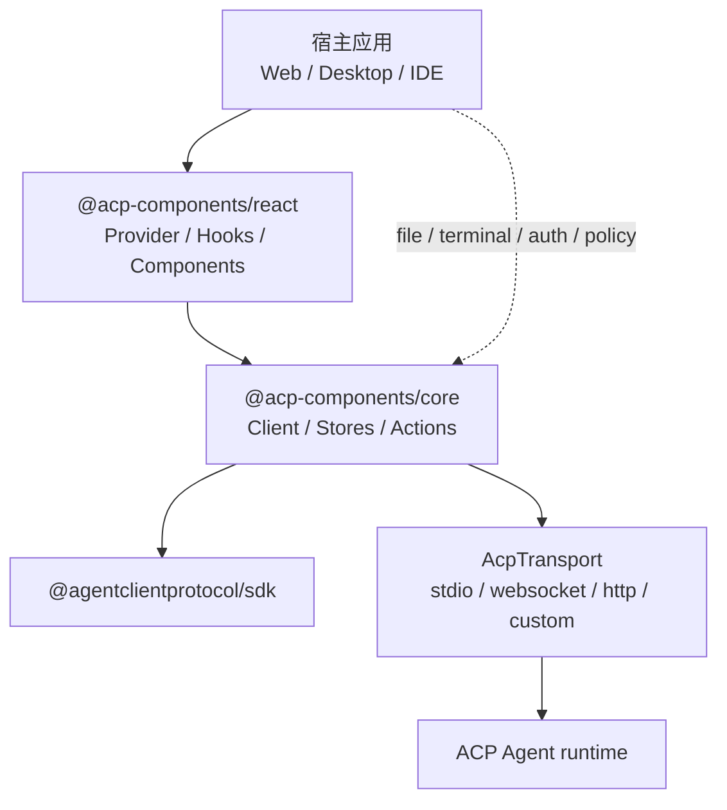
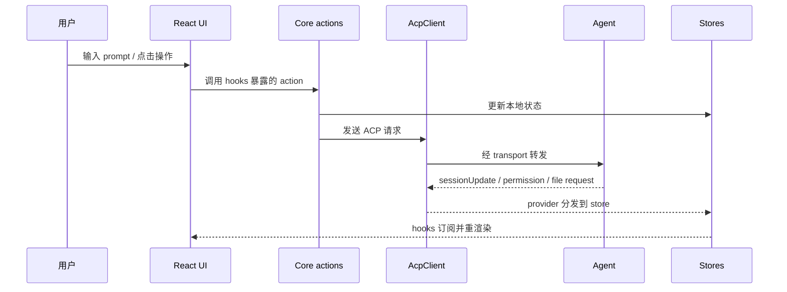

# acp-components 架构文档

## 1. 架构定位

`acp-components` 是基于 Agent Client Protocol, 下称 ACP, 的 Agent 工作台组件库。它不直接实现 Agent runtime，也不替宿主应用接管系统权限，而是提供一套可嵌入的前端协议、状态和 UI 基础组件。

核心目标：

- 让 Web、桌面、IDE 插件等宿主快速接入 ACP Agent。
- 把协议通信、状态管理和 UI 解耦。
- 把文件、终端等高风险能力留在宿主侧治理。
- 支持后续替换传输、替换 UI 框架、扩展 Agent 能力。

## 2. 总体结构



分层职责：

| 层级 | 主要职责 |
| --- | --- |
| 宿主应用 | 选择传输、提供文件/终端能力、制定权限策略、组合布局 |
| `@acp-components/react` | React Provider、hooks、聊天/会话/权限/diff/状态组件、主题和 i18n |
| `@acp-components/core` | ACP client、transport 抽象、store、actions、session update 分发 |
| ACP SDK | 协议类型、握手和连接 |
| Agent runtime | 推理、工具调用、session update |

## 3. 关键边界

### 3.1 包边界

- `packages/core` 是框架无关核心包，只暴露协议、状态和 actions。
- `packages/react` 只依赖 core，把 vanilla store 转为 React hooks 和组件。
- `examples/*` 只作为集成示例，不反向决定核心 API。

### 3.2 状态边界

当前采用两个 vanilla Zustand store：

| Store | 负责内容 |
| --- | --- |
| `acpStore` | 连接状态、Agent 信息、会话列表、当前会话、项目 cwd |
| `sessionStore` | 单会话消息、流式状态、工具调用、权限队列、计划、用量、配置项、命令 |

这样可以让导航状态和高频会话状态分离，也方便未来接入 Vue / Svelte / Solid 等非 React 适配层。

## 4. 核心接口

### 4.1 Provider

Provider 是宿主进入组件库的主入口：

- 输入：`transport`、`clientInfo`、`clientCapabilities`、`defaultCwd`、文件回调、主题。
- 行为：建立连接、initialize、注册 session update、注册权限和文件回调、同步 store。
- 输出：ready 后提供 `client`、配置和项目上下文给 React 组件树。

架构要求：Provider 不应内置宿主安全策略，只根据宿主传入能力声明 capability。

### 4.2 Transport

所有传输统一为 `AcpTransport`：

```ts
interface AcpTransport {
  connect(): Promise<Stream>;
  disconnect(): void;
  onClose?: (handler: () => void) => () => void;
  onError?: (handler: (err: Error) => void) => () => void;
}
```

当前支持：

| 传输 | 场景 | 评审关注 |
| --- | --- | --- |
| stdio | 桌面或 Node 直接启动 Agent | command 来源、env、cwd、进程退出 |
| WebSocket | 浏览器连接桥接服务 | 鉴权、Origin、TLS、断线恢复 |
| HTTP | 受限单向 POST 场景 | 不等价于完整双向流式协议 |
| custom | Tauri/Electron/extension/iframe 等 | 宿主自定义生命周期和安全策略 |

### 4.3 Session update

Agent 推送的 `sessionUpdate` 统一在 core provider 层转换为 store action。UI 只消费归一化后的 state。

新增 update 类型时应同时补齐：

- store 字段和 action
- provider 分发
- hook selector
- UI 展示或 fallback
- 测试覆盖


## 5. UI层设计

`@acp-components/react` 提供的 UI 大致分三层：

| 层级 | 内容 | 说明 |
| --- | --- | --- |
| Provider + Context | `useAcpProvider`、`context` | 初始化连接、注入 client 和 store 到组件树 |
| Hooks | `useSession`、`useSessions`、`usePrompt`、`useToolCalls`、`usePermission`、`useConnectionStatus` 等 | 订阅 store 状态，暴露 action 给组件 |
| Components | `workbench`、`chat-view`、`session-list`、`status-bar`、`permission-dialog`、`diff-view`、`terminal-view`、`command-palette`、`session-config-panel` | 完整工作台布局及独立功能区块 |

组件之间的通信通过 core 层的 store 完成，不直接互调。每个组件可按需独立使用，也可以拼成完整工作台。

另外，主题通过 CSS 变量 + `context` 注入，i18n 在 `packages/react/src/i18n` 中维护，均为可选接入。

## 6. 数据流



## 7. 扩展性设计

项目在以下几个维度预留了扩展点：

| 扩展维度 | 机制 | 说明 |
| --- | --- | --- |
| 传输层 | `AcpTransport` 接口 | 实现 `connect / disconnect / onClose / onError` 即可接入新传输协议 |
| 框架适配 | core 与框架解耦 | core 为 vanilla store + actions，目前有 React 适配层，后续可增加 Vue、Svelte 等 |
| UI 组件 | 独立可组合 | 各组件独立消费 store，宿主可按需拼装工作台布局，也可替换任意组件 |
| 宿主能力 | 回调 + store | 文件读写通过 Provider 回调（`onFileRead`/`onFileWrite`）交给宿主实现；权限策略通过 `sessionStore` 中的请求队列 + `PermissionDialog` 组件完成用户交互，宿主可替换 UI 或在 core 层覆盖 `setPermissionHandler` 实现自动审批 |

## 8. 后续规划

- 支持多workspace，多agent
- 支持MACP UI, A2UI，等动态UI能力
- 支持自定义展示工具界面
