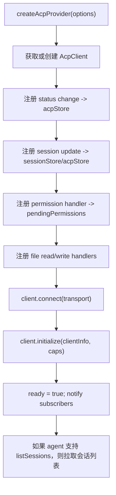
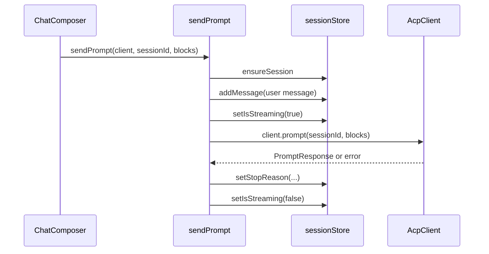
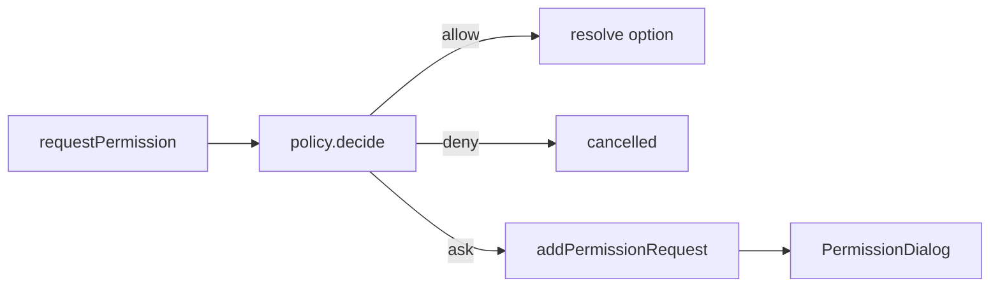

# acp-components 详细设计文档

> 面向核心开发者和二次集成开发者。本文是按需查阅的实现参考，保留代码级接口、状态模型和扩展步骤；整体架构评审请优先阅读更精简的 [ARCHITECTURE.md](ARCHITECTURE.md)。

## 1. 设计目标

详细设计文档用于把架构原则落到可维护的代码边界：

- 说明当前实现中关键文件的职责。
- 解释 ACP client、transport、provider、store、actions、React hooks 和组件之间的调用关系。
- 给出新增传输、新增 session update、新增权限策略、新增 UI 能力时的实现路径。
- 记录当前实现的已知边界，避免未来扩展时把职责错误下沉到 UI 或示例项目中。
- 补充一部分尚未实现但适合该项目方向的设计草案，供后续演进参考。

## 2. 当前代码地图

```text
acp-components/
  packages/
    core/
      src/
        client/AcpClient.ts
        transport/types.ts
        transport/stdio.ts
        transport/http.ts
        transport/ws.ts
        store/acpStore.ts
        store/sessionStore.ts
        actions/sessions.ts
        actions/prompt.ts
        actions/permission.ts
        provider.ts
        types/index.ts
        index.ts
    react/
      src/
        components/workbench/AcpProvider.tsx
        components/workbench/Workbench.tsx
        components/chat-view/ChatView.tsx
        components/chat-view/MessageBubble.tsx
        components/chat-view/ChatComposer.tsx
        components/chat-view/ToolCallCard.tsx
        components/chat-view/PlanView.tsx
        components/chat-view/ThoughtView.tsx
        components/permission-dialog/PermissionDialog.tsx
        components/status-bar/UsageBar.tsx
        hooks/useAcpProvider.ts
        hooks/useAcpStore.ts
        hooks/useSessionStore.ts
        hooks/useSessions.ts
        hooks/useSession.ts
        hooks/usePrompt.ts
        hooks/usePermission.ts
        hooks/useToolCalls.ts
        context/AcpContext.ts
        i18n/
        styles/
        index.ts
  examples/
    demo/
    server/
    tauri/
```

## 3. Core 包设计

### 3.1 `AcpClient`

文件：`packages/core/src/client/AcpClient.ts`

`AcpClient` 是对 ACP SDK `ClientSideConnection` 的薄封装，主要职责是：

- 根据 `TransportConfig` 创建具体 transport。
- 把 transport 返回的 stream 交给 `ClientSideConnection`。
- 注册 client-side callbacks，包括 `sessionUpdate`、`requestPermission`、`readTextFile`、`writeTextFile`。
- 对外提供会话、prompt、取消、配置项和关闭等方法。
- 管理连接状态和 agent metadata。

当前方法契约：

| 方法 | 输入 | 输出 | 说明 |
| --- | --- | --- | --- |
| `connect(config)` | `TransportConfig` | `Promise<void>` | 创建 transport，建立 stream，初始化 `ClientSideConnection` |
| `initialize(clientInfo, clientCapabilities)` | implementation 和 capability | `InitializeResponse` | 发送 ACP initialize，保存 agentInfo / capabilities |
| `newSession(cwd, mcpServers)` | cwd, mcp servers | `NewSessionResponse` | 创建会话 |
| `prompt(sessionId, prompt)` | sessionId, content blocks | `PromptResponse` | 发送 prompt |
| `cancel(sessionId)` | sessionId | `void` | 发送取消通知 |
| `listSessions(cursor, cwd)` | cursor, cwd | `ListSessionsResponse` | 获取会话列表 |
| `loadSession(sessionId, cwd, mcpServers)` | sessionId, cwd | `LoadSessionResponse` | 加载已有会话 |
| `setSessionConfigOption(sessionId, configId, value)` | string 或 boolean value | response | 修改 Agent 会话配置项 |
| `closeSession(sessionId)` | sessionId | `void` | 当前实现通过 cancel 达到关闭效果 |
| `disconnect()` | 无 | `void` | 断开 transport 并清理 connection |

建议后续补强：

- `closeSession` 与 ACP 协议真实语义对齐，避免长期把 close 映射为 cancel。
- 将 `_capabilities` 的类型从 `Record<string, unknown>` 收敛到 SDK 类型或项目内 typed facade。
- 增加 request timeout、initialize timeout、connect abort。
- 暴露结构化错误，例如 `TransportError`、`ProtocolError`、`AgentError`。
- 在 `connect()` 中处理重复连接，避免同一个 client 残留旧 transport。

### 3.2 Transport 接口

文件：`packages/core/src/transport/types.ts`

```ts
export interface AcpTransport {
  connect(): Promise<Stream>;
  disconnect(): void;
  onClose?: (handler: () => void) => () => void;
  onError?: (handler: (err: Error) => void) => () => void;
}
```

设计要点：

- `connect()` 是唯一必须返回协议 stream 的入口。
- `disconnect()` 应幂等，允许 provider cleanup 重复调用。
- `onClose` 和 `onError` 是状态同步入口，不应在 transport 内直接改 store。
- transport 不感知 React、不感知 sessionStore，只做字节流或消息流适配。

### 3.3 现有传输实现

#### 3.3.1 `StdioTransport`

文件：`packages/core/src/transport/stdio.ts`

当前实现：

- 使用 `node:child_process.spawn` 启动 Agent 进程。
- stdin 映射为 `WritableStream<Uint8Array>`。
- stdout 映射为 `ReadableStream<Uint8Array>`。
- 使用 SDK 的 `ndJsonStream` 把字节流包装为 ACP stream。

关键注意事项：

- 适合 Node / Electron / 桌面主进程环境，不适合纯浏览器。
- 生产环境应限制 `command` 来源，避免任意命令执行。
- 应处理 stderr、exit code、spawn ENOENT 和进程组清理。
- 后续可支持 cwd、signal、kill timeout、stderr diagnostics。

#### 3.3.2 `WebSocketTransport`

文件：`packages/core/src/transport/ws.ts`

当前实现：

- 浏览器原生 `WebSocket`。
- outgoing message 直接 `JSON.stringify` 后发送。
- incoming message 解析为 SDK `AnyMessage`。

关键注意事项：

- 适合浏览器连接桥接服务器。
- 生产环境需要鉴权、TLS、Origin 校验和断线重连策略。
- 当前没有队列、ack 或 backpressure，长输出场景需要桥接层和 UI 共同治理。

#### 3.3.3 `HttpTransport`

文件：`packages/core/src/transport/http.ts`

当前实现：

- `WritableStream<AnyMessage>` 的每个 write 都发起一次 HTTP POST。
- `ReadableStream` 当前为空，适合作为受限环境的单向发送示例。

关键注意事项：

- 不适合完整双向 Agent session update。
- 若要生产化，需要和 SSE、long polling 或 response streaming 组合。
- 应在文档和类型层标记 capability 限制，避免集成方误以为它等价于 WebSocket。

#### 3.3.4 Custom transport

`TransportConfig` 支持：

```ts
{ type: 'custom'; transport: AcpTransport }
```

推荐用于：

- Tauri IPC。
- Electron IPC。
- Chrome extension port。
- iframe `postMessage`。
- 远端 workspace gateway。
- 测试中的 in-memory transport。

## 4. Provider 生命周期

### 4.1 Core provider

文件：`packages/core/src/provider.ts`

`createAcpProvider()` 负责组装连接生命周期：



### 4.2 Capability 合并

当前 provider 根据宿主是否传入文件回调决定是否声明文件能力：

- `onFileRead` 存在时声明 `fs.readTextFile = true`。
- `onFileWrite` 存在时声明 `fs.writeTextFile = true`。
- 其他 `clientCapabilities` 与文件能力合并。

设计原则：

- capability 是安全边界的一部分，不能为了展示 UI 而声明未实现能力。
- 后续如果加入 terminal、auth、clipboard、workspace search 等能力，也应由宿主显式启用。

### 4.3 Session update 分发

当前 provider 对 `update.sessionUpdate` 做集中分发：

| update 类型 | store 操作 | 说明 |
| --- | --- | --- |
| `agent_message_chunk` | `appendContent(sessionId, msgId, 'agent', content)` | Agent 文本或内容块 |
| `user_message_chunk` | `appendContent(sessionId, msgId, 'user', content)` | 用户内容块 |
| `agent_thought_chunk` | `appendThought(sessionId, msgId, 'agent', content)` | 思考内容 |
| `tool_call` | `upsertToolCall(sessionId, tc)` | 新增或覆盖工具调用 |
| `tool_call_update` | `updateToolCall(sessionId, id, patch)` | 增量追加 content / locations |
| `plan` | `setPlan(sessionId, entries)` | 当前计划快照 |
| `session_info_update` | `acpStore.updateSession(sessionId, patch)` | title / updatedAt |
| `usage_update` | `setUsage(sessionId, update)` | token / context 使用量 |
| `config_option_update` | `setConfigOptions(sessionId, options)` | Agent 会话配置 |
| `available_commands_update` | `setAvailableCommands(sessionId, commands)` | slash commands |

新增 update 类型时建议按以下顺序实现：

1. 在 `types/index.ts` 增加归一化后的状态类型。
2. 在 `sessionStore.ts` 或 `acpStore.ts` 增加字段和 action。
3. 在 `provider.ts` 的 switch 中处理 update。
4. 在 React hook 中暴露 selector。
5. 在组件中实现展示。
6. 增加测试，覆盖 update -> store -> hook 的数据链路。

### 4.4 当前 provider 的边界

当前实现使用 `globalClient` 单例。优点是单工作台简单，缺点是：

- 不支持同一 JS runtime 中多个独立 provider。
- React StrictMode、热重载或嵌套 provider 场景需要更严格的幂等保证。
- 多 workspace / 多 Agent panel 需要 scoped store 与 scoped client。

推荐未来设计：

```ts
export interface AcpRuntimeScope {
  client: AcpClient;
  acpStore: StoreApi<AcpStoreState>;
  sessionStore: StoreApi<SessionStoreState>;
  actions: AcpActions;
}

export function createAcpRuntimeScope(options: AcpProviderOptions): AcpRuntimeScope;
```

React `AcpProvider` 可以持有一个 scope，并通过 context 传递，而不是依赖全局单例。

## 5. Store 详细设计

### 5.1 `acpStore`

文件：`packages/core/src/store/acpStore.ts`

职责：保存全局导航与连接级状态。

当前字段：

| 字段 | 类型 | 说明 |
| --- | --- | --- |
| `connectionStatus` | `disconnected | connecting | connected | error` | 连接生命周期状态 |
| `agentInfo` | `Implementation | null` | Agent 名称、版本等信息 |
| `capabilities` | `Record<string, unknown> | null` | Agent capabilities |
| `sessions` | `Map<SessionId, SessionMeta>` | 会话元信息 |
| `activeSessionId` | `SessionId | null` | 当前会话 |
| `projectCwd` | `string` | 当前项目目录 |

设计建议：

- `sessions` 只保存元信息，不保存消息内容。
- `projectCwd` 是宿主与 session 创建之间的桥梁，不应在 UI 组件中重复存储。
- `capabilities` 建议未来强类型化，并和 UI capability gates 对齐。

### 5.2 `sessionStore`

文件：`packages/core/src/store/sessionStore.ts`

职责：保存按会话分区的高频交互状态。

当前 `SessionData`：

| 字段 | 说明 |
| --- | --- |
| `messages` | 会话消息列表，包含 content、thought、tool_calls parts |
| `isStreaming` | prompt 是否正在进行 |
| `pendingToolCalls` | 以 `toolCallId` 为 key 的工具调用状态 |
| `stopReason` | 最近一次 prompt 停止原因 |
| `pendingPermissions` | 待用户/宿主响应的权限请求队列 |
| `plan` | Agent 当前计划 |
| `usage` | token / context 使用情况 |
| `configOptions` | Agent 会话配置项 |
| `availableCommands` | 可用 slash commands |

消息追加规则：

- 如果 messageId 已存在，则追加到该消息。
- 如果最后一个 part 类型相同且都是 text block，则合并文本，减少 fragment。
- tool call 会同步写入 `pendingToolCalls` 和最近一条 Agent 消息的 `tool_calls` part。
- tool call update 会追加 content / locations，而不是覆盖历史内容。

后续建议：

- 为长消息增加 segment / virtualization 支持。
- 为 tool call 增加 completed / failed / cancelled 分区，避免 `pendingToolCalls` 名称与实际状态不一致。
- 权限请求队列建议改为更明确的 `permissionQueue`，并增加 requestId。
- store action 应补单元测试，尤其是文本合并、tool call update 和 resetSession。

## 6. Actions 详细设计

### 6.1 会话 actions

文件：`packages/core/src/actions/sessions.ts`

| action | 当前行为 | 后续建议 |
| --- | --- | --- |
| `createSession` | 调 `client.newSession`，写入 `acpStore` 和 `sessionStore` | 支持 mcpServers、模板配置和错误回滚 |
| `loadSession` | reset session 后调 `client.loadSession` | 如果 load 失败，考虑保留旧消息或显示错误状态 |
| `selectSession` | 设 active 后尝试 load | 切换前后需要处理 streaming 会话 |
| `closeSession` | 调 client.closeSession 后删除 store | close 语义需要和 ACP 对齐 |
| `refreshSessions` | `listSessions` 后覆盖 sessions map | 支持 cursor pagination |
| `setSessionConfigOption` | 失败时恢复旧 configOptions | 增加错误提示与 optimistic update 状态 |

### 6.2 Prompt actions

文件：`packages/core/src/actions/prompt.ts`

当前流程：



设计注意：

- 用户消息采用本地生成 id，是一种乐观展示。
- Agent 消息由 session update 驱动，不由 prompt response 直接生成。
- 异常时当前实现把 stopReason 设为 `cancelled`，未来应区分 user cancel、transport error、agent error、policy deny。

### 6.3 Permission actions

文件：`packages/core/src/actions/permission.ts`

当前模型：

- provider 收到 `requestPermission` 后创建 `PermissionRequest`。
- `PermissionRequest` 内含 `resolve(optionId)` 和 `reject()`。
- `respondToPermission` 取队列第一个请求并 resolve。
- `denyPermission` 取队列第一个请求并 reject。

后续建议：

- 为 permission request 增加稳定 id，避免同 session 多请求时误响应。
- 支持 policy preflight：自动 allow / deny / ask。
- 支持超时取消。
- 支持审计记录，包括 request 摘要、结果、操作者和时间。
- UI 中展示更明确的风险分级、路径、命令和影响范围。

## 7. React 包详细设计

### 7.1 React `AcpProvider`

文件：`packages/react/src/components/workbench/AcpProvider.tsx`

职责：

- 调用 `useAcpProvider(options)`。
- 连接 ready 前显示 loading。
- ready 后通过 `AcpContext.Provider` 提供 `client`、`config`、`clientInfo`、`projectCwd`。
- 根据 `theme` 设置 `data-acp-theme`。
- 将 `defaultCwd` 同步到 core `acpStore`。

当前 props：

```ts
export interface AcpProviderProps {
  transport: TransportConfig;
  clientInfo?: Implementation;
  clientCapabilities?: ClientCapabilities;
  theme?: 'light' | 'dark';
  children: React.ReactNode;
  onFileRead?: FileReadHandler;
  onFileWrite?: FileWriteHandler;
  defaultCwd?: string;
}
```

后续建议：

- `theme` 支持自定义字符串，而不是仅 `light | dark`。
- loading 和 error 状态支持自定义渲染。
- provider options 变化时定义清晰行为，是重建连接还是忽略。
- 多 provider 需要 scope context。

### 7.2 Hooks

hooks 的设计目标是让 UI 组件只关心领域数据，不直接访问协议。

| hook | 主要职责 |
| --- | --- |
| `useAcpProvider` | 创建 core provider 并订阅 ready |
| `useAcpStore` | 订阅全局 vanilla store |
| `useSessionStore` | 订阅 session store |
| `useSessions` | 会话列表、创建、选择、关闭、刷新 |
| `useSession` | 单会话消息、streaming、plan、usage、config、commands |
| `usePrompt` | 发送与取消 prompt |
| `useToolCalls` | 提取工具调用 |
| `usePermission` | 当前权限请求与响应动作 |
| `useConnectionStatus` | 连接状态与 agentInfo |
| `useAcpContext` | 访问 client 和 provider context |

设计约束：

- hook 可以组合 actions 和 stores，组件不应直接导入 core actions。
- selector 应尽量窄，避免长会话输出导致无关组件频繁重渲染。
- 对 `sessionId = null` 的场景提供空态返回，避免组件分支过多。

### 7.3 Workbench 布局

文件：`packages/react/src/components/workbench/Workbench.tsx`

当前设计是三栏布局：

- `sidebar`：会话、项目、导航。
- `main`：聊天或主工作区。
- `panel`：diff、terminal、inspector 等辅助区域。

未来扩展建议：

- 使用 slot 命名约定，例如 `sidebar`, `main`, `rightPanel`, `bottomPanel`。
- 支持 panel collapse / resize。
- 将布局状态交给宿主或可选 layout store，避免 core store 膨胀。

### 7.4 ChatView

文件：`packages/react/src/components/chat-view/ChatView.tsx`

职责：

- 根据 `sessionId` 从 `useSession` 获取数据。
- 将消息按用户消息和后续 Agent 消息分组为 round。
- 渲染 header、config panel、usage bar、message list、plan、composer。
- 在 messages 或 streaming 变化时滚动到底部。

round 分组逻辑：

```ts
interface Round {
  userMessage?: Message;
  agentMessages: Message[];
}
```

后续建议：

- 长会话时引入 virtualization，避免所有 message DOM 常驻。
- 自动滚动应区分用户是否正在查看历史。
- round grouping 可抽到可测试的纯函数。
- plan、usage、composer 可作为 slot，适配不同产品形态。

### 7.5 Message 渲染

消息模型：

```ts
export type MessagePart =
  | { type: 'content'; content: ContentBlock[] }
  | { type: 'thought'; thought: ContentBlock[] }
  | { type: 'tool_calls'; toolCalls: ToolCallState[] };
```

渲染策略：

- content blocks 渲染为 Markdown、文本、文件引用等。
- thought blocks 渲染为可折叠区域。
- tool calls 渲染为 `ToolCallCard`。

安全建议：

- Markdown 渲染默认不应允许未清洗 HTML。
- raw output 应限制高度、支持折叠和复制前脱敏。
- 文件路径点击应通过 `onNavigateFile` 交给宿主，不直接打开本地路径。

### 7.6 PermissionDialog

文件：`packages/react/src/components/permission-dialog/PermissionDialog.tsx`

当前设计：

- 从 `usePermission(sessionId)` 获取当前请求。
- 显示工具标题和 raw input。
- 根据 options 渲染 deny / allow 按钮。
- 点击后调用 `respond` 或 `deny`。

未来增强：

- 展示风险等级和影响范围。
- 对文件写入显示 diff preview。
- 对命令执行显示 cwd、命令、环境变量摘要。
- 支持 "允许一次"、"本会话允许"、"当前 workspace 允许"、"始终拒绝"。
- 将按钮数量从假设三个 options 改成按 `options` 动态渲染。

## 8. 主题与国际化

### 8.1 主题

当前主题基于 CSS custom properties：

- `--acp-color-*`
- `--acp-shadow-*`
- `--acp-radius-*`
- `--acp-font-*`
- `--acp-duration-*`
- `--acp-ease-*`

设计建议：

- 组件样式只引用 token，不硬编码产品色。
- 主题切换使用 `[data-acp-theme='...']`。
- React props 应允许自定义 theme id。
- 文档中区分 "内置主题" 和 "主题契约"。

### 8.2 国际化

当前 React 包内置 i18n provider 和中英文资源。

设计建议：

- key 命名保持 `{domain}.{semanticName}`。
- 业务状态文案不要写死在组件内。
- 错误消息需要保留原始诊断，同时提供用户友好文案。
- 宿主应可以覆盖局部 key，而无需复制整份语言包。

## 9. 扩展开发指南

### 9.1 新增传输

实现步骤：

1. 在 `packages/core/src/transport/` 新增 transport 文件。
2. 实现 `AcpTransport`。
3. 在 `transport/index.ts` 导出。
4. 在 `types/index.ts` 的 `TransportConfig` 增加 discriminated union 分支。
5. 在 `AcpClient.createTransport` 的 switch 中实例化。
6. 增加示例或测试。

示例草案：

```ts
export class IpcTransport implements AcpTransport {
  async connect(): Promise<Stream> {
    const writable = new WritableStream<AnyMessage>({
      write: async (message) => {
        await ipc.send('agent-input', message);
      },
    });

    const readable = new ReadableStream<AnyMessage>({
      start: (controller) => {
        const unsubscribe = ipc.on('agent-output', (message) => {
          controller.enqueue(message);
        });
        return unsubscribe;
      },
    });

    return { readable, writable };
  }

  disconnect(): void {
    ipc.send('agent-disconnect');
  }
}
```

### 9.2 新增 session update

实现步骤：

1. 明确 update 是 session 级还是 global 级。
2. 在对应 store 增加字段和 action。
3. 在 provider switch 中处理。
4. 在 hook 中暴露数据。
5. 增加 UI 组件或扩展现有组件。
6. 为 unknown / missing 字段提供 fallback。

示例：新增 `checkpoint_update`。

```ts
// sessionStore
checkpoints: CheckpointState[];
setCheckpoints: (sessionId, checkpoints) => void;

// provider
case 'checkpoint_update':
  store.setCheckpoints(sessionId, update.checkpoints);
  break;

// hook
const checkpoints = useSession(sessionId).checkpoints;
```

### 9.3 新增工具调用渲染器

当前 `ToolCallCard` 是通用展示。未来可以引入 registry：

```ts
export interface ToolRendererContext {
  sessionId: SessionId;
  toolCall: ToolCallState;
  onNavigateFile?: (path: string, line?: number | null) => void;
}

export type ToolRenderer = (context: ToolRendererContext) => React.ReactNode;

export interface ToolRendererRegistry {
  get(toolName: string): ToolRenderer | undefined;
}
```

集成方可以为 `edit_file`、`run_command`、`search`、`web_fetch` 等工具提供专用渲染，而未知工具继续走默认卡片。

### 9.4 权限策略扩展

推荐未来引入 policy 接口：

```ts
export type PermissionDecision =
  | { type: 'allow'; optionId: string; reason?: string }
  | { type: 'deny'; reason?: string }
  | { type: 'ask'; risk?: 'low' | 'medium' | 'high'; message?: string };

export interface PermissionPolicy {
  decide(request: PermissionRequest): Promise<PermissionDecision>;
}
```

provider 收到 permission request 后先调用 policy：



这样可以在不改变 UI 组件的前提下支持企业策略、workspace allowlist、工具风险分级和审计。

### 9.5 文件能力扩展

当前 file callbacks 是：

- `onFileRead`
- `onFileWrite`

建议生产级扩展为：

- path normalization
- allowed roots
- max file size
- binary file rejection
- read-only mode
- write preview / diff approval
- audit event

接口草案：

```ts
export interface FileAccessPolicy {
  canRead(request: ReadTextFileRequest): Promise<FileAccessDecision>;
  canWrite(request: WriteTextFileRequest): Promise<FileAccessDecision>;
}
```

### 9.6 非 React adapter

Core 暴露 vanilla store，所以其他框架可以直接桥接。

Vue composable 草案：

```ts
import { onUnmounted, ref } from 'vue';
import { acpStore } from '@acp-components/core';

export function useAcpStoreVue<T>(selector: (state: AcpStoreState) => T) {
  const value = ref(selector(acpStore.getState()));
  const unsubscribe = acpStore.subscribe((state) => {
    value.value = selector(state);
  });
  onUnmounted(unsubscribe);
  return value;
}
```

Svelte store 草案：

```ts
import { readable } from 'svelte/store';
import { sessionStore } from '@acp-components/core';

export function createSessionReadable(selector) {
  return readable(selector(sessionStore.getState()), (set) => {
    return sessionStore.subscribe((state) => set(selector(state)));
  });
}
```

## 10. 示例应用设计

### 10.1 Browser demo

目录：`examples/demo`

典型链路：

```text
Vite browser demo
  -> WebSocketTransport
  -> examples/server bridge
  -> Agent stdio
```

职责：

- 展示 React 包的最小集成。
- 验证 WebSocket transport。
- 不承担生产级鉴权和隔离。

### 10.2 Bridge server

目录：`examples/server`

典型职责：

- 接受浏览器 WebSocket 连接。
- 为每个连接启动或绑定 Agent 进程。
- 在 WebSocket message 与 Agent stdin/stdout 之间转发。

生产化建议：

- 增加认证。
- 限制可启动 command。
- 隔离 cwd。
- 限制并发和输出大小。
- 记录 agent exit reason。
- 支持 graceful shutdown。

### 10.3 Tauri example

目录：`examples/tauri`

设计价值：

- 展示 custom transport 如何接入桌面 IPC。
- 把 Agent 进程治理放在 Tauri/Rust 层。
- React UI 不需要知道底层是 stdio 还是 IPC。

## 11. 测试策略

### 11.1 Core 单元测试

优先覆盖：

- `sessionStore.appendContent` 文本合并。
- `sessionStore.upsertToolCall` 和 `updateToolCall`。
- `permission` 队列响应。
- `prompt` action 成功、失败、取消。
- `sessions` action 的 optimistic update 和回滚。
- `AcpClient` 在 mock transport 上的 connect / initialize / disconnect。

### 11.2 React 组件测试

优先覆盖：

- `AcpProvider` ready 前后渲染。
- `ChatView` 空 session、streaming、round grouping。
- `PermissionDialog` option 渲染和回调。
- `ToolCallCard` 对 raw input/output、locations、status 的展示。
- i18n key fallback。

### 11.3 集成测试

建议建立 in-memory transport：

```ts
class MemoryTransport implements AcpTransport {
  clientReadable = new ReadableStream<AnyMessage>();
  clientWritable = new WritableStream<AnyMessage>();

  async connect(): Promise<Stream> {
    return {
      readable: this.clientReadable,
      writable: this.clientWritable,
    };
  }

  disconnect(): void {}
}
```

用它模拟：

- initialize response。
- sessionUpdate 流。
- permission request。
- transport close / error。

## 12. 性能设计

当前实现适合中小型会话。长会话和大量工具调用场景需要后续治理：

- message list virtualization。
- tool output 折叠与懒渲染。
- Markdown 渲染缓存。
- 大 raw output 截断和按需展开。
- selector 粒度收窄。
- sessionStore 按 session 拆分为更小 store 或 scoped store。
- usage / plan / config option 更新去抖。

需要避免：

- 每个 chunk 导致整个 workbench 重渲染。
- 大型 Map 克隆扩散到无关 session。
- raw output 直接全部渲染到 DOM。

## 13. 错误处理设计

建议统一错误模型：

```ts
export type AcpRuntimeError =
  | { type: 'transport'; message: string; cause?: unknown }
  | { type: 'protocol'; message: string; method?: string; cause?: unknown }
  | { type: 'agent'; message: string; code?: string; cause?: unknown }
  | { type: 'permission'; message: string; requestId?: string }
  | { type: 'file'; message: string; path?: string; operation: 'read' | 'write' };
```

UI 展示原则：

- 用户看到可理解的错误摘要。
- 开发者能展开原始诊断。
- 错误归属清晰，是连接、协议、Agent、权限还是文件。
- 错误不应吞掉 ready 状态或导致空白页。

## 14. 未来扩展蓝图

### 14.1 Scoped runtime

目标：支持多 workspace / 多 provider。

核心变化：

- 从 global stores 迁移到 scope stores。
- React context 提供 scope。
- hooks 从当前 context 读取 store，而不是直接导入全局 store。
- 保留全局导出作为简单模式或兼容层。

### 14.2 Plugin slots

目标：让集成方替换部分 UI，而不是 fork 组件库。

可扩展 slot：

- message part renderer
- tool call renderer
- permission detail renderer
- right panel
- command palette provider
- status bar item
- file navigation handler

### 14.3 Capability-driven UI

目标：UI 根据 Agent 和宿主能力动态展示。

示例：

- Agent 不支持 `listSessions` 时隐藏刷新或历史会话入口。
- 宿主未声明 `fs.writeTextFile` 时，文件写入权限不显示 allow write。
- Agent 支持 config options 时显示 `SessionConfigPanel`。
- 支持 terminal capability 时显示 terminal panel。

### 14.4 Production bridge

目标：从 demo bridge 演进到可部署网关。

能力：

- auth and tenant context
- workspace sandbox
- process pool
- concurrency limits
- audit log
- reconnect and resume
- secret redaction
- per-session resource limits

这部分应放在独立包或示例中，不应塞进 `@acp-components/core`。

## 15. 实现守则

后续代码修改建议遵守：

- 协议事件只在 core provider 层转成 store action。
- UI 组件不直接解析 transport message。
- 权限和文件能力必须经过宿主回调或 policy。
- 新增 public export 需要考虑 semver。
- 新增 store 字段需要配套 action、hook 和测试。
- 示例工程不反向定义核心架构。
- 大能力优先通过扩展点接入，不把所有功能堆进 `ChatView`。
- 保持 `core` 无 React 依赖。
